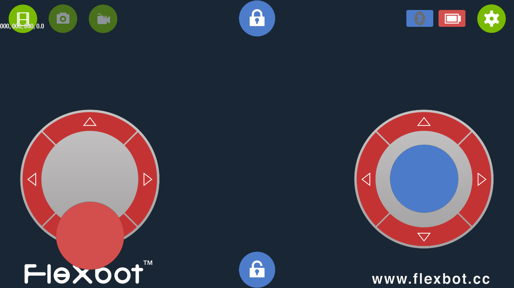

### Flexbot(1.x버전) 이라는 드론 조정앱을 안드로이드 스튜디오로 실행해 보았습니다.
- 앱 실행 결과 미리보기(아래)

- 원본 깃 허브 위치와 정보 입니다.(아래)
- 원본 깃 허브위치: https://github.com/HexAirbot/HexNanoController_Android
- 한국어 도움말은 오르카 카페에서: https://cafe.naver.com/openrt/6789
- 루비페이퍼출판사의 [드론 제작 완벽 가이드] 책 소개에 관련 정보가 자세히 있습니다(아래) https://www.rubypaper.co.kr/entry/%EB%93%9C%EB%A1%A0-%EC%A0%9C%EC%9E%91-%EC%99%84%EB%B2%BD-%EA%B0%80%EC%9D%B4%EB%93%9C-1
- -----------------------------------------------------
- 위 소스의 원본은 이클립스 기반으로 개발되었기 때문에 현재 깃 허브의 작업은 아래와 같습니다.
- 기존 개발환경을 이클립스에서 -> 안드로이드 스튜디오 환경으로 변경해 보았습니다.(아래)
- 앱 IDE 개발환경 변경: 이클립스에서 -> 안드로이드 스튜디오 2022.9 돌핀 버전(그래들빌드버전 7.3.0)
- 앱 실행환경: 안드로이드4.4.x(갤럭시 S1) 에서 테스트 해 보았음.